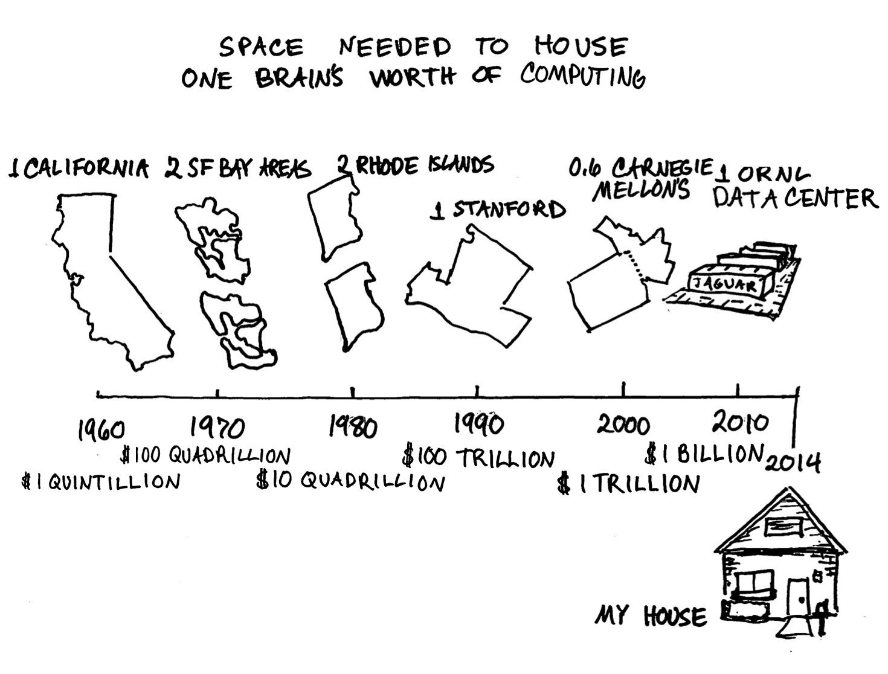

#### Context

Within 20 years, the raw processing power and memory capacity needed to match a human brain will be available for around $100.
Right now, there are some machines which already posses the raw power of a human brain, like ONRL&#39;s Titan.
Barring catastrophe, it seems a foregone conclusion that the human brain will cease to be the peak of intellectual capability on earth.
And while the transition is certain, the consequences of it are still largely up to us.
So what better way to relay our knowledge than to teach a machine the same way we teach our own children.
For if machine intelligence is fostered with the same care we give to fostering our own children, it is likely that the transition will bring humans much closer together and be an incredibly beneficial event for human intelligence, machine intelligence, and the universe as a whole.

Not only then will our values be intact, but we will relate to a machine intelligence and it will also be able to relate to us.

emotions
tensions / misunderstandings
improve judgment yes, reinvent the core mechanisms, no.